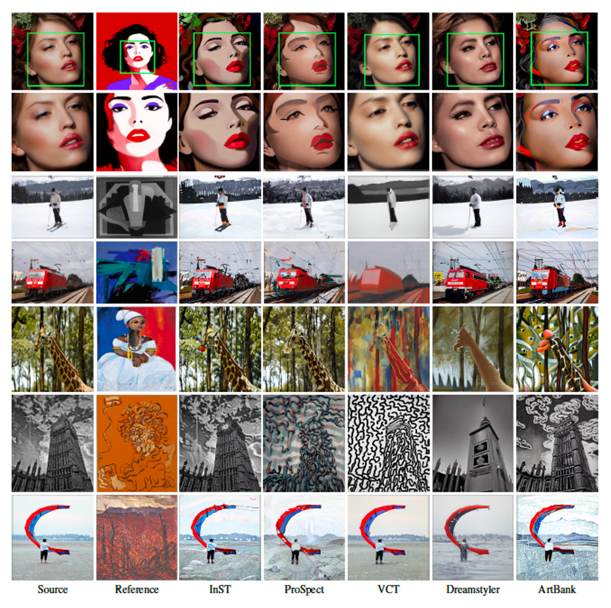

# Style Transfer SOTA_Models-v1

## &#x1F4E2; Project Report Overview
1. &#x2705; Style Transfer 비교 모델 조사
2. &#x1F680; 인퍼런스 실험 진행
    - &#x2705; (완료) 실험 진행: MSCOCO 2017, FFHQ 등의 이미지 인퍼런스 테스트
    - &#x1F525; (예정) 비교 모델 5개 - 인퍼런스용 코드 정리
    - &#x1F525; (예정) 환경 구축: Docker 생성
    - &#x1F525; (예정) 실험 진행: Effeect 이미지 인퍼런스 전수 완료

----

## &#x1F31F; Style Transfer 모델 리스트
- InST (CVPR 2023)
- ProSpect (SIGGRAPH Asia 2023)
- VCT (ICCV 2023)
- Dreamstyler (AAAI 2024)
- ArtBank (AAAI 2024)

---

## Comparison Results
- Qualitative comparisons of state-of-the-art diffusion models with zoomed-in views of stylized images on the MS-COCO 2017 dataset with four types of reference images from Wikiart.

- Qualitative comparisons of state-of-the-art diffusion models on the FFHQ dataset with four types of reference images from Wikiart.

